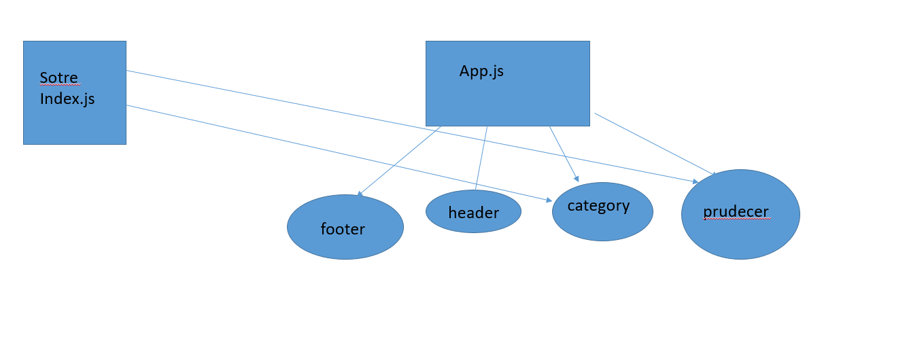

LAB - 32

Author: bayan alalem

Setup

`npx create-react-app my-app --use-npm ` `npm install node-sass@4.14.1` 

## detailes about files

### index.js
render the app.js function in the `
 root` block 

### app.js 

1- Create the function which render the catogry   and proudect  and footerand header  get all data from form as props 
### catogriy.js 
redux useing dispatch active and make action on the catogry 
### product.js 
redux  useing to  to show the product 
### header.js and  footer.js 
 

UML Diagram
